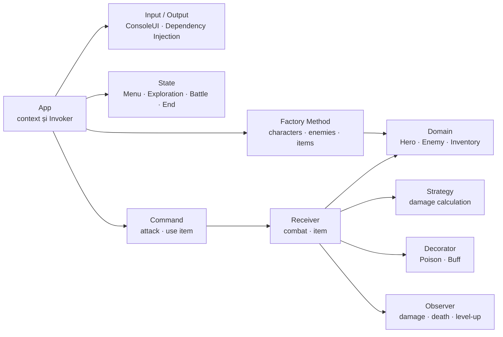

# Architecture overview

Diagrama arată arhitectura planificată

## Diagramă de arhitectură

```mermaid
flowchart LR
    io["Input / Output<br/>ConsoleUI · Dependency Injection"]
    app["App<br/>context și Invoker"]
    state["State<br/>Menu · Exploration · Battle · End"]
    factory["Factory Method<br/>characters · enemies · items"]
    command["Command<br/>attack · use item"]
    receiver["Receiver<br/>combat · item"]
    strategy["Strategy<br/>damage calculation"]
    domain["Domain<br/>Hero · Enemy · Inventory"]
    decorator["Decorator<br/>Poison · Buff"]
    observer["Observer<br/>damage · death · level-up"]

    app --> io
    app --> state
    app --> factory
    app --> command
    factory --> domain
    command --> receiver
    receiver --> strategy
    receiver --> domain
    receiver --> decorator
    receiver --> observer
```
